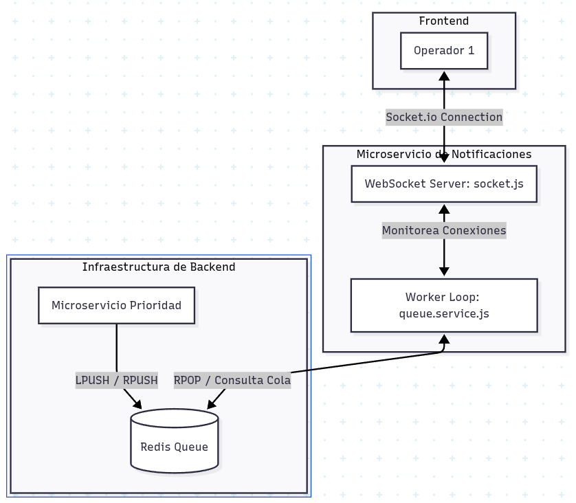

# Documentación del Microservicio de Notificaciones

Este microservicio forma parte del **Sistema de Alerta Ciudadana Distribuido tipo C5**. Su propósito principal es despachar en tiempo real las alertas ciudadanas procesadas y enriquecidas a los terminales de los operadores (frontend) a través de conexiones persistentes de WebSockets, utilizando una cola en memoria en Redis como buffer de contingencia y tolerancia a fallos.

---

## 1. Arquitectura General y Flujo de Datos

El microservicio de notificaciones actúa en la capa de salida y visualización en tiempo real del sistema. Su funcionamiento se basa en un patrón de tipo **Productor-Consumidor**:

1. **Encolamiento:** Los microservicios previos de procesamiento y asignación de prioridad colocan las alertas estructuradas en una cola centralizada de Redis.
2. **Consumo Seguro (Worker):** El microservicio ejecuta un bucle infinito (*Worker*) que monitorea de manera constante la cola. Antes de consumir elementos, valida si hay operadores conectados.
3. **Distribución en Tiempo Real:** Emite las alertas extraídas a todas las estaciones de trabajo conectadas mediante WebSockets.



---

## 2. Resiliencia y Tolerancia a Fallos

El servicio incorpora tres estrategias lógicas esenciales para garantizar la robustez e integridad de la comunicación crítica de emergencias (conforme a las directrices de diseño descritas en el [ADR-002: Redundancia con Redis](file:///home/maxxow/Repos/c5_alerta_ciudadana/Docs/adr/ADR-002-redis.md)):

### A. Prevención de Pérdida de Eventos (Condición de Carrera)
Para evitar la pérdida de eventos de emergencia cuando no existen terminales de operadores activas:
* El Worker verifica la cantidad de sockets conectados: `io.sockets.sockets.size`.
* Si el tamaño es `0` (ningún operador conectado), el bucle se detiene temporalmente mediante un retraso de `1000ms` y vuelve a verificar, **sin extraer ningún mensaje de la cola de Redis**.
* Esto asegura que las alertas críticas permanezcan seguras en la base de datos en memoria hasta que al menos una terminal del operador esté disponible para su despliegue y atención.

### B. Control de Flujo (Backpressure de Renderización)
Para evitar la congelación del navegador y saturación de renderizado en la UI (desarrollada en React) durante ráfagas masivas de incidentes:
* El Worker aplica un retraso deliberado de `100ms` tras transmitir cada alerta por WebSocket antes de proceder a la siguiente iteración del buffer.

### C. Recuperación de Caídas
El bucle principal del Worker se encuentra protegido por un bloque `try-catch`. Si ocurre un fallo crítico de red o indisponibilidad temporal de la base de datos de Redis:
* El error es capturado e impreso en consola.
* El servicio entra en un ciclo de suspensión de `5000ms` (5 segundos) antes de intentar restablecer el consumo de la cola, previniendo la detención del contenedor.


## 3. Configuración y Variables de Entorno

El servicio se parametriza a través de variables de entorno del sistema operativo:

| Variable | Descripción | Valor por Defecto |
| :--- | :--- | :--- |
| `PORT` | Puerto de escucha para el servidor HTTP y Socket.io. | `3001` |
| `REDIS_URL` | URI de conexión para el almacén de datos de Redis. | `redis://redis:6379` |

### Parámetro de Cola Hardcoded
* **Nombre de la cola:** `alertas_pendientes` (gestionado a nivel de clave en Redis con operaciones `RPOP`).

---

## 4. Contrato de Eventos WebSockets

El servidor emite notificaciones a través de la conexión persistente TCP de Socket.io utilizando el siguiente esquema de comunicación:

* **Nombre del Evento:** `nueva_alerta`
* **Dirección:** Servidor (notificaciones) $\rightarrow$ Cliente (operadores frontend)
* **Payload (JSON):**
  ```json
  {
    "alert_id": "a3b98c7d-6e5f-4d3c-2b1a-0e9d8c7b6a5f",
    "device_id": "ESP32_PANIC_01",
    "lat": 19.432607,
    "lon": -99.133209,
    "zone": "Zona Centro",
    "sector": "Sector A",
    "emergency_type": "Incendio",
    "priority_level": "Crítica",
    "status": "Pendiente",
    "timestamp": "2026-06-17T16:05:00.000Z"
  }
  ```

---

## 5. Configuración de Despliegue (Docker Compose)

En producción y desarrollo, el servicio se despliega a través del archivo principal [docker-compose.yaml](file:///home/maxxow/Repos/c5_alerta_ciudadana/docker-compose.yaml) utilizando una imagen ligera de Node y montaje de volúmenes para el soporte de cambios en tiempo real:

```yaml
  notificaciones:
    image: node:20-alpine
    container_name: c5_notificaciones
    working_dir: /app
    volumes:
      - ./services/notificaciones:/app
      - /app/node_modules
    command: sh -c "npm install && node index.js"
    networks:
      - c5_network
    ports:
      - "3001:3001"
    environment:
      - REDIS_URL=redis://redis:6379
    depends_on:
      - redis
```

---

## 6. Dependencias del Proyecto

De acuerdo con el archivo [package.json](file:///home/maxxow/Repos/c5_alerta_ciudadana/services/notificaciones/package.json), las dependencias instaladas son:

* `express` (`^5.2.1`): Servidor HTTP base.
* `redis` (`^6.0.0`): Conector principal de Redis (soporte para comandos v6+ como `rPop`).
* `ioredis` (`^5.4.1`): Cliente alternativo para configuraciones avanzadas.
* `socket.io` (`^4.8.3`): Módulo de comunicación en tiempo real sobre WebSockets.
* `ws` (`^8.18.0`): Implementación ligera complementaria del protocolo WebSocket.
